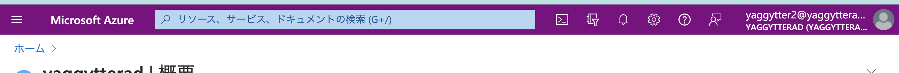
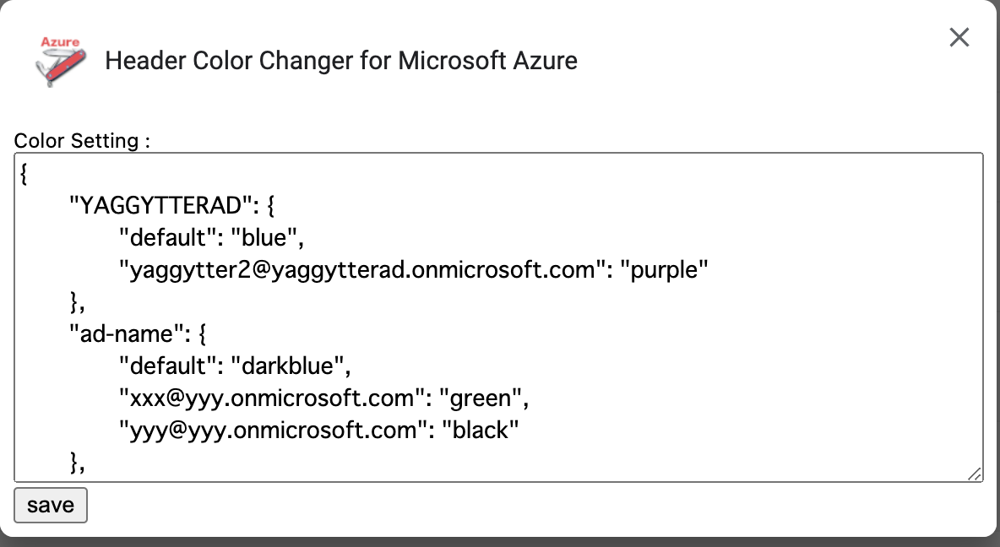

# Header Color Changer for Microsoft Azure

[日本語の説明はこちら](./blob/main/README_ja.md)

This extension is to ensure visibility and reduce mistakes for Azure users who handle multiple Azure ADs and Users.

## How to use

You just add this extension from chrome web store.
You can also contribute to add your functions to this.
